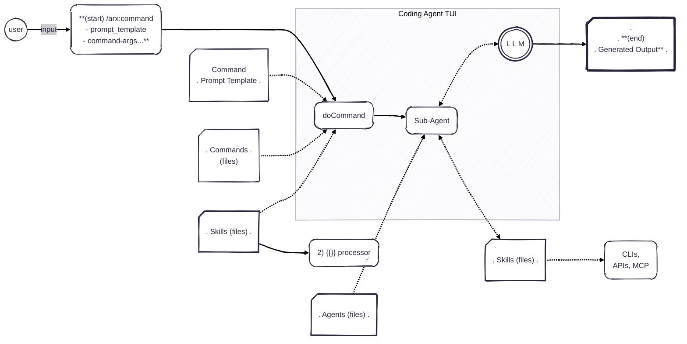

# AgenTrx Process Overview
## An overview of using AgentRx in an iterative, incremental software development process.

## Project Documentation
See: [Project Dev Files](../PROJECT_STRUCT.md) for an outline of the recommended documentation structure for an AgentRx project. In many ways, the process for AgentRx, iterative and incremental development entails creating & updating these documents as you work through the development process. 

## Prompt-Driven Primitives
The core primitives for using AgentRx in a development process are: 
- Prompt creation: Using `/agentrx:prompt-new` to create new prompt files for Agent-assisted development. (TODO:)Prompts can be a generic "vibe" prompt by default. Or the user can specify a template to use for the prompt file
either a custom template or referincing an artifact "type" as outlined in [Project Docs](../PROJECT_STRUCT.md).
- Prompt execution: Using `/agentrx:prompt-do` to execute prompt files and generate outputs (e.g. design documents, code snippets, test cases).

## Foundation: AgentRx Templated Prompt Commands

## Iterative Development Workflow
### Generic Flow for 1 Iteration
/prompt-new (User: summary and optional variables)
  -> System: creates a new, prompt file--
 New prompt file with summary and optional variables
  -> elaborate/review prompt & context docs -> prompt-do => (code or interim artifact) -> review output -> update docs/specs -> ... (repeat until done)